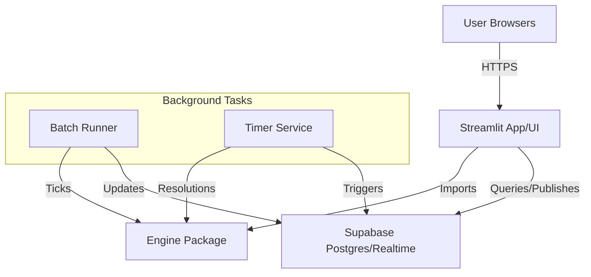
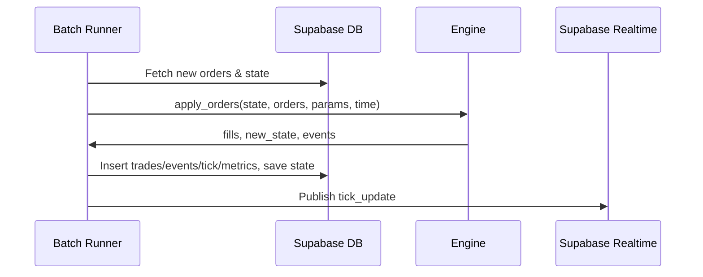

# Gaming Market Demo

## Introduction

The Gaming Market Demo is a proof-of-concept implementation of an Automated Market Maker (AMM) system designed for high-volume speculation on multi-outcome events, such as AI agent competitions or social games. Inspired by platforms like Polymarket, it emphasizes engaging gambling mechanics to drive hype and volatility rather than accurate probability forecasting. Each outcome is treated as an independent binary market ("Will this outcome win? YES or NO"), with users trading fixed-payout tokens that redeem for $1 USDC if correct.

Key highlights:
- Supports 3–10 mutually exclusive outcomes with tunable price impacts (own and cross-outcome).
- Hybrid trading: Market orders with slippage controls and batched limit orders via a pool-based Limit Order Book (LOB).
- Features like cross-matching (YES/NO peer-to-peer), auto-filling on impacts, and optional multi-resolution (phased eliminations with renormalization).
- Deterministic Python engine ensuring solvency (bounded risk ≤ Z subsidy) and no trade rejections (asymptotic penalties).
- Built for a 20-person demo: Streamlit UI, Supabase for persistence/realtime, background runners for batch ticks and timed resolutions.

This demo is not production-ready (no auth beyond admin password, simulated USDC, local security). For full technical details, see [Gaming Market TDD.md](Gaming Market TDD.md) (design goals, math derivations, proofs) and [Implementation Plan for Gaming Market Demo.md](Implementation Plan for Gaming Market Demo.md) (architecture, flows, data model).

## Features

- **Multi-Outcome Binary Markets**: Trade YES/NO tokens per outcome; prices in $0–$1 with tunable asymmetry and coupling.
- **Trading Modes**: Market orders (max slippage), limit orders (batched LOB with pro-rata fills).
- **Advanced Mechanics**:
  - Cross-matching: Peer-to-peer YES buys with NO sells for tighter spreads.
  - Auto-filling: Automatic execution of opt-in limits on cross-impacts, capturing seigniorage (surplus allocation via σ).
  - Multi-resolution: Phased eliminations with liquidity redistribution and price renormalization (virtual supplies, optional capping).
- **Dynamic Parameters**: Linear interpolation of ζ, μ, ν, κ from start to end values (reset/continue per round).
- **User Controls**: Max slippage, auto-fill opt-in; gas fees (flat per submission, even on rejects).
- **UI Elements**: Polymarket-like tabs/selectors, order tickets with confirmations (est slippage/cost/gas), order books, trades/positions tables, countdowns, leaderboard.
- **Admin Tools**: Config form (params, schedules), monitoring, manual overrides, CSV exports (trades/config/metrics/rankings with gas/% gain), Matplotlib graphs (volume, MM risk/profit).
- **Realtime Updates**: Supabase channels for tick/resolution events; UI polls/reruns for <500ms refreshes.
- **Solvency & Bounds**: Total MM risk ≤ Z; invariants preserved (q_eff < L_i per binary).

## Architecture

The system uses a client-server architecture with Streamlit for UIs, a deterministic Python engine for core logic, Supabase for DB/realtime, and background runners for processing.

### System Overview



### Tick Processing Flow



## Setup Instructions

1. **Clone the Repository**:
   ```
   git clone <repo-url>
   cd gaming-market-demo
   ```

2. **Install Dependencies**:
   ```
   pip install -r requirements.txt
   ```

3. **Configure Environment**:
   - Copy `.env.example` to `.env` and fill in values (e.g., `SUPABASE_URL`, `SUPABASE_SERVICE_KEY`, `DATABASE_URL`, `ADMIN_PASSWORD`).

4. **Set Up Database**:
   - Use Supabase dashboard or CLI to create a project.
   - Run migrations:
     ```
     # Apply schema via Supabase SQL editor or psql
     psql -d $DATABASE_URL -f app/db/schema.sql
     psql -d $DATABASE_URL -f app/db/migrations/001_initial.sql
     psql -d $DATABASE_URL -f app/db/migrations/002_add_gas_metrics.sql
     ```

5. **Seed Configuration** (optional, for default params):
   ```
   python app/scripts/seed_config.py --n_outcomes 3 --z 10000
   ```

## Running the Demo

1. **Start Participant UI**:
   ```
   streamlit run app/streamlit_app.py
   ```
   - Access at `http://localhost:8501` (shareable link).

2. **Start Admin Dashboard**:
   ```
   streamlit run app/streamlit_admin.py
   ```
   - Access at `http://localhost:8502`; enter `ADMIN_PASSWORD` from `.env`.

3. **Background Services**:
   - Runners (batch/timer) start automatically via UI buttons or integrate in apps.
   - For manual: Run `app/runner/batch_runner.py` and `app/runner/timer_service.py` in separate terminals.

## Usage

### Admin
- **Configure**: Use form to set outcomes, params (e.g., Z=10000, γ=0.0001, ζ_start=0.1, ζ_end=0.01), toggles, resolution schedule.
- **Start Demo**: Click to set status=RUNNING, initialize start_ts, fund users.
- **Monitor**: View users, ticks, metrics; manual freeze/resolve if needed.
- **Exports**: Download CSVs (trades: `python app/scripts/export_csv.py trades.csv`); view graphs.

### Participants
- **Join**: Enter display name → Get user_id, starting balance.
- **Trade**: Select outcome, YES/NO, order type/size/price/slippage/af_opt_in; confirm with est cost/gas/slippage.
- **View**: Order book (aggregated bids/asks), recent trades, positions, open orders (cancelable), balance.
- **Resolution**: Auto-pauses; see eliminations, payouts in balances.
- **End**: View rankings (% gain/loss = (final - start)/start, trades, gas costs), graph.

Example Order Submission (UI):
- Outcome 1, YES, Market, Size=100, Max Slippage=0.05 → Confirm shows est ~$50 cost + $0.01 gas.

## Testing

- **Unit Tests**: Engine-focused; run `pytest app/engine/tests/`.
  - Covers state/params, amm_math (quadratics/penalties), impacts, autofill, lob_matching, orders (integration), resolutions (renormalization/invariants).
- **Manual Demo**: Seed config, start apps/runners, join as users, trade, verify resolutions/payouts match solvency (total risk ≤Z).
- **Edges**: Zero subsidy, oversized trades (infinite cost), multi-res sum preservation, dynamic params interpolation.

## Deployment

- **Local**: As above; use ngrok for sharing Streamlit URLs.
- **Cloud**: Host on Streamlit Sharing or VPS; Supabase for DB (free tier sufficient for demo).
- **Future**: Adapt engine for SUI blockchain (low gas for solves/loops); add auth/KYC for production.

## Technical Details

### Core Mechanics (from TDD)
- **Prices/Solvency**: p_yes = q_yes_eff / L_i < p_max; invariants q_eff < L_i ensure payouts < L_i (V_i + subsidy_i).
- **Buy/Sell**: Quadratic solves for X with asymmetry (μ,ν), convexity (κ), coupling (ζ, f_i=1-(N_active-1)ζ).
- **Penalties**: Asymptotic (η exponent) for p' bounds.
- **Cross-Matching**: YES buy/NO sell at complementary ticks; fees f_match.
- **Auto-Filling**: Binary search max Δ per pool; seigniorage (σ share) reduces penalties.
- **Multi-Resolution**: Eliminate, payout NO, redistribute freed (L_k - q_no_k), renormalize virtual_yes (target p_yes = old / post_sum * pre_sum_yes; cap ≥0 if vc_enabled).
- **Dynamic Tuning**: Linear p(t) = start + (t/T)(end - start); reset per round if mr_enabled.

### Data Model (Postgres Tables)
- `config`: params (JSONB), status (enum), start_ts.
- `users`: user_id, display_name, balance, net_pnl, trade_count.
- `positions`: user_id, outcome_i, yes_no (enum), tokens.
- `orders`: user_id, outcome_i, yes_no, type (enum), size, limit_price, max_slippage, af_opt_in, status (enum), ts_ms.
- `lob_pools`: outcome_i, yes_no, is_buy, tick (int), volume, shares (JSONB {user:share}).
- `trades`: outcome_i, yes_no, buy/sell_user_id, price, size, fee, tick_id, ts_ms.
- `ticks`: tick_id, ts_ms, summary (JSONB prices/volumes).
- `events`: type, payload (JSONB), ts_ms.
- `metrics`: tick_id, volume, mm_risk, mm_profit.

### Engine API
- `apply_orders(state: EngineState, orders: List[Order], params: EngineParams, current_time: int) -> (fills, new_state, events)`
- `trigger_resolution(state: EngineState, params: EngineParams, is_final: bool, elim_outcomes: List[int]|int) -> (payouts, new_state, events)`

For contributions or issues, see repository files (e.g., /engine for core logic, /db for schema).